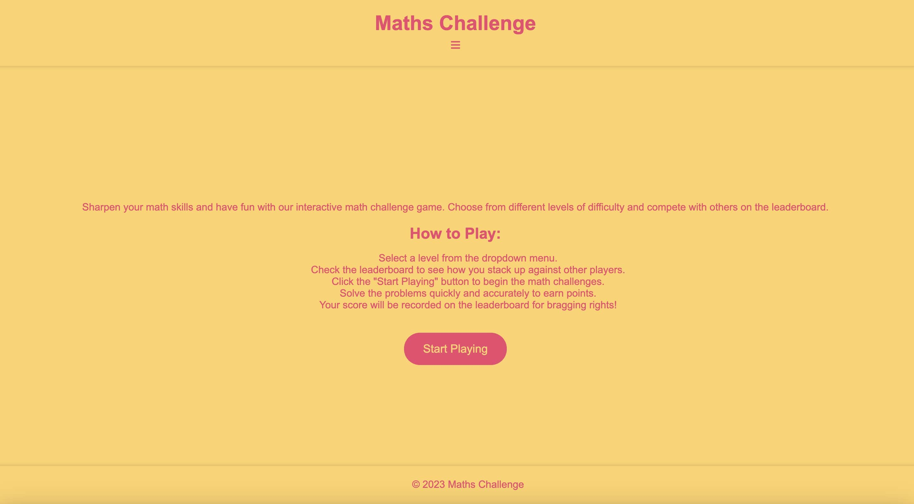
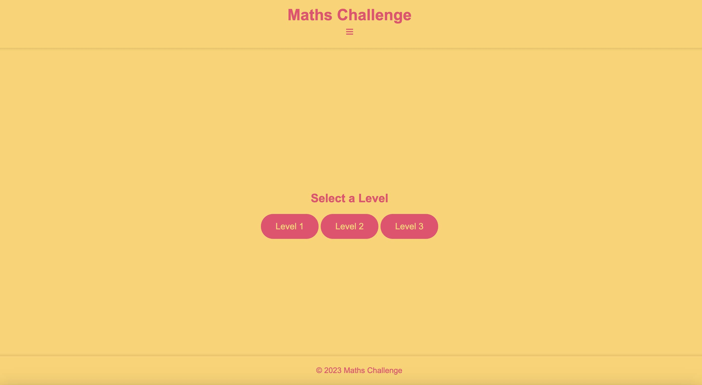
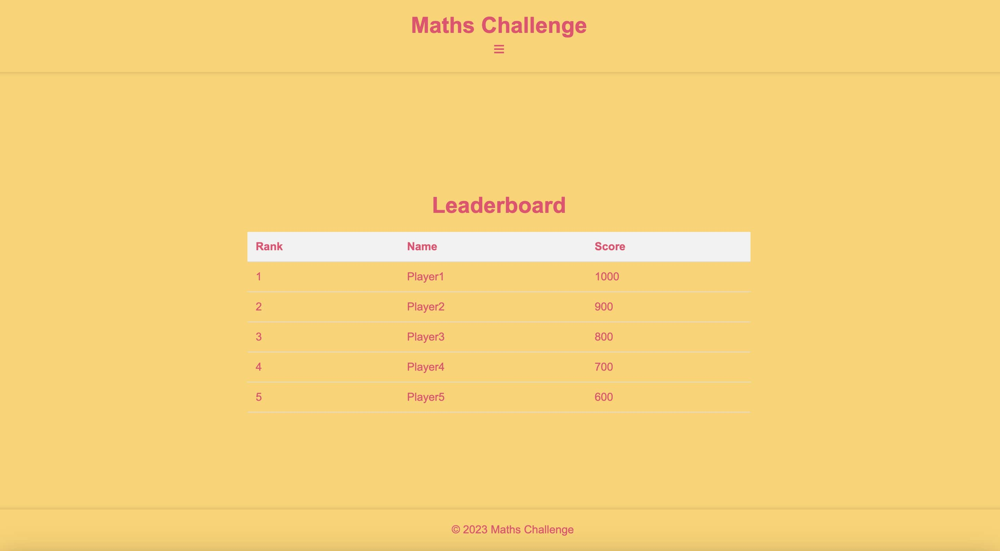

# Welcome to Maths Challenge! :video_game: :star2:

## Overview :brain:
Dive into the world of interactive learning and fun with our HTML-based math game! Maths challenge is designed to help you practice addition, subtraction, multiplication, and division through a series of random and challenging questions. This game offers a dynamic platform that combines the thrill of gaming with the benefits of improving your arithmetic skills.

## Why Choose Maths Challenge? :thinking:
- **Educational Fun:** Enjoy the excitement of gaming while learning math.
- **Randomized Questions:** Face a variety of challenges to keep you engaged.
- **Real-time Feedback:** Get instant feedback to enhance your understanding.
- **Leaderboard:** Compete with friends or challenge yourself to climb the leaderboard and showcase your math prowess.

## Key Features :key:
- **Four Operations:** Practice addition, subtraction, multiplication, and division in one place.
- **Randomized Challenges:** Never face the same question twice to keep the excitement alive!
- **Leaderboard:** See how you stack up against others and track your progress.

## How to Play :book::open_book:
1. Select a level from the dropdown menu.
2. Check the leaderboard to see how you stack up against other players.
3. Click the "Start Playing" button to begin the math challenges.
4. Solve the problems quickly and accurately to earn points.
5. Your score will be recorded on the leaderboard for bragging rights!

# Let the math games begin! :trophy:

## Features 

### Landing page 

### Choose your level

### Game Page

### Leaderboard

## The basics

### Header with an open and close navigation

### Footer

## Wirefames

## Credits

I extend gratitude to Code Institute for knowledge in HTML and CSS, enabling me to bring my ideas to life. The transformative journey from a nursing career to coding unveiled the healing power of meditation and yoga, essential tools in navigating the transition.

I have taken some skills I have learnt from code institute such as the drop down boxes and incorporated it with some extra leanring on navigation options, which can be found [here](<https://www.youtube.com/watch?v=iXKScihfSwE>).

Creating better visual effects for my users experience was impirtant,I added an extra colour to links for users to know it was a link when they hovered their cursor of over the link. I got this informstion from [here](<https://developer.mozilla.org/en-US/docs/Web/CSS/:hover#>). 

Finally, I wanted to create a simple, soft, emotional vibe to my styles, by adding the opaque style to the containers - information found [here](<https://developer.mozilla.org/en-US/docs/Learn/CSS/Howto/Make_box_transparent>). Aswell as creating a background which relates to the activties of the page - this to me, created a chnnce for users to get a feel of what they could experience when practising our yoga. The images used were sourced from [freeimages](<https://www.freeimages.com>) I then created the background using this [app](<https://www.sketchbook.com>) by collating the images and added a shadow to the images on top so this would not be harsh on the eyes.
