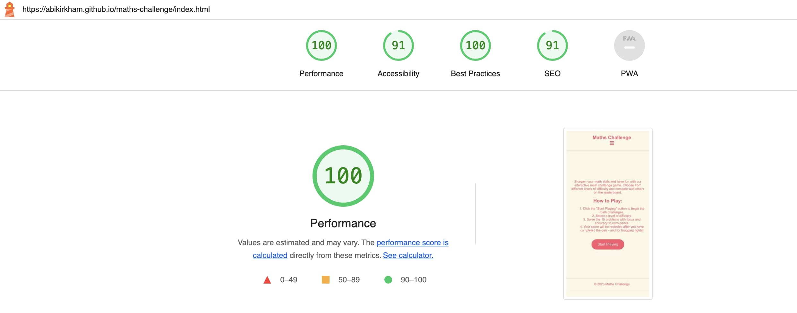
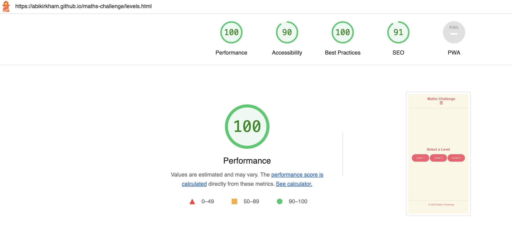
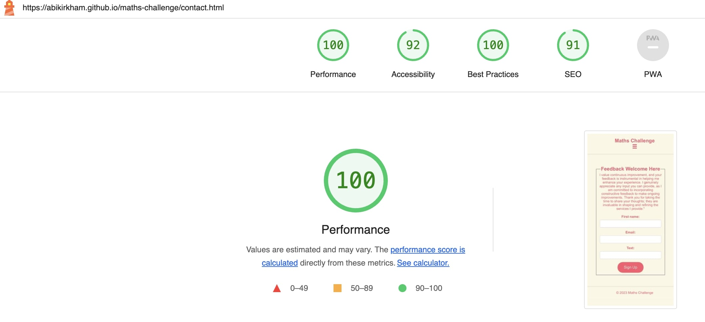
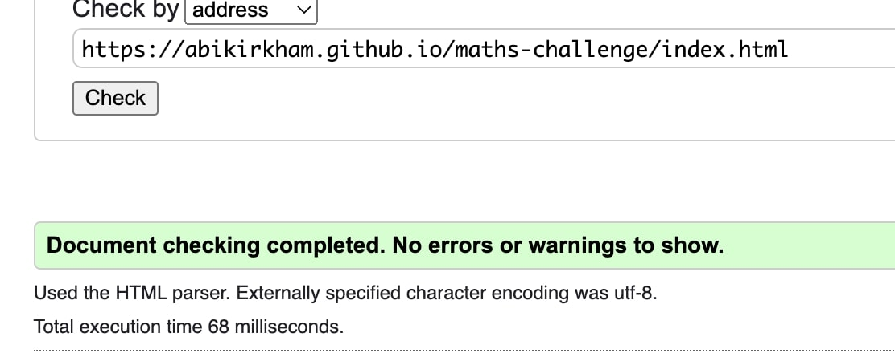
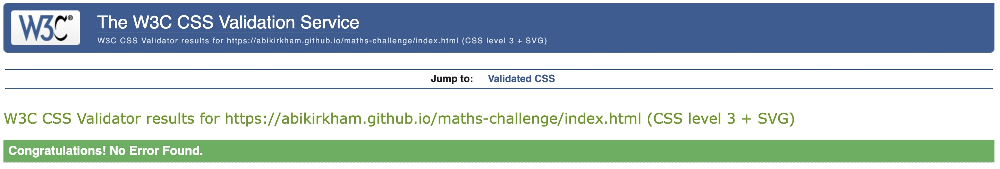

# Welcome to Maths Challenge! :video_game: :star2:

## Maths Challenge Contents
1. [Why Choose Maths Challenge?](#why-choose-maths-challenge)
2. [User Stories](#user-stories)
3. [Features](#features)
4. [Features](#features)
5. [Wireframes](#wireframes)
6. [Accessibility and Transparency](#accessibility-and-transparency)
7. [Testing](#testing)
8. [Deployment](#deployment)
9. [Credits](#credits)
    
## Overview :brain:
Dive into the world of interactive learning and fun with our JavaScript-based math game! Maths challenge is designed to help you practice addition, subtraction, multiplication, and division through a series of random and challenging questions. This game offers a dynamic platform that combines the thrill of gaming with the benefits of improving your arithmetic skills.

## Why Choose Maths Challenge? :thinking:
- **Educational Fun:** Enjoy the excitement of gaming while learning math.
- **Randomized Questions:** Face a variety of challenges to keep you engaged.
- **Real-time Feedback:** Get instant feedback to enhance your understanding.
- **A chance to offer feedback:** Change the game to suit your needs. Your feedback has a high chance of getting implmented. I am always here to improve.

## Key Features :key:
- **Four Operations:** Practice addition, subtraction, multiplication, and division in one place.
- **Randomised Challenges:** Never face the same question twice to keep the excitement alive!
- **Leaderboard:** See how you stack up against others and track your progress.

## How to Play :book::open_book:
1. Click the "Start Playing" button to begin the math challenges.
2. Select a level of difficulty.
3. Solve the problems quickly and accurately to earn points.
4. Your score will be recorded after you have completed the quiz - and for bragging rights!

## Technologies Used

- **HTML/CSS:** Frontend styling and structure.
- **JavaScript:** Interactive features and game logic.
- **GitHub/Gitpod:** Version control and collaboration.

## Let the math games begin! :trophy:

# User Stories

### Students Seeking Math Practice
As a student, I want to use Maths Challenge to practice addition, subtraction, multiplication, and division in a fun and interactive way, helping me improve my math skills.
I want the game to provide randomised questions to keep me engaged and challenged.
Real-time feedback is crucial for me to understand my mistakes and learn from them.

### Teachers Looking for Educational Games
As a teacher, I am excited to introduce Maths Challenge to my students as an engaging and educational game.
I appreciate the variety of challenges offered by the game, helping students practice different math operations.
The leaderboard feature allows me to track the progress of my students and motivate them to improve.

### Parents Supporting Their Children's Learning
As a parent, I see Maths Challenge as a valuable tool for my child's math development.
I appreciate the option to select different difficulty levels to match my child's skill level.
The game's real-time feedback ensures my child is learning and grasping mathematical concepts effectively.

### Individuals Wanting to Enhance Quick Math Skills
As an individual seeking to improve my mental math skills, I find Maths Challenge to be a perfect platform.
The randomised challenges and time pressure help me think on my feet and improve my quick math calculations.
I value the leaderboard feature, as it allows me to compare my performance with others and set personal goals.

### Friends Competing Against Each Other
As friends looking for a fun and competitive math game, we enjoy the multiplayer aspect of Maths Challenge.
We can challenge each other by selecting the same difficulty level and see who can score higher.
The game's dynamic nature ensures that each round is a new and exciting experience.

### Users Seeking a Quick and Fun Brain Exercise
As someone looking for a quick and enjoyable brain exercise, I appreciate the simplicity and accessibility of Maths Challenge.
The game's structure, with different levels and randomized challenges, keeps me entertained during short breaks.
I can easily track my progress and see improvements in my math skills over time.

### Users Who Enjoy Providing Feedback
As a user who enjoys providing feedback, I appreciate the opportunity to share my thoughts on Maths Challenge.
Knowing that my feedback has a high chance of being implemented makes me feel valued as a user.
I find the contact page user-friendly, and the option to offer feedback adds to the overall positive experience.

### Competitive Individuals Looking for a Challenge
As a competitive individual seeking a challenging math game, I am drawn to the variety of questions in Maths Challenge.
The scoring system and leaderboard provide a clear measure of my performance against others.
I enjoy the thrill of competing and improving my rank on the leaderboard.

## Features 

### Landing page 
This webpage is designed for a math challenge game where users can sharpen their math skills. It provides information about the game, instructions on how to play, and links to navigate through different sections such as levels and leaderboard. The design suggests a responsive layout, including a mobile-friendly menu. The inclusion of JavaScript indicates the potential for dynamic and interactive features on the webpage.

### Choose your level
This HTML code sets up a page where users can select a level for the math challenge game. The selected level triggers a JavaScript function (startGame) associated with the respective level number. The overall structure, styling, and navigation remain consistent with the previous page.

### Game Page
This page sets up a game for a math challenge game, providing a user interface for solving math problems and tracking scores. The page incorporates buttons for different math operations and dynamically updates the display based on user interactions.

### Contact Page
The contact.html page is where I have a chance to accept feedback from users. This includes a thankyou.html where the submit for will send you to go back to the index.html to start playing again if the user wishes. 

## The basics

### Header with an open and close navigation
I've decided to incorporate a discreet navigation feature that becomes visible upon clicking the three-lined icon. This menu encompasses the homepage, provides access to various levels for playing the math challenge game, and includes a leaderboard to monitor progress. Below, you can preview its appearance when both open and closed.

### Footer
Immerse yourself in the thrill of numbers with @2023 Maths Challenge. My footer proudly displays the essence of mathematical excellence, encapsulating the spirit of the challenge in a single phrase. 

## Wirefames

1. Index HTML:
- The index.html serves as the main entry point for your website. It typically contains:
- A welcoming and visually appealing introduction to your math game.
- Navigation links or buttons directing users to various sections of your website, such as the game levels, leaderboard, and any additional features.
- Any important information or instructions for users, such as how to play the game or system requirements.

2. Levels HTML:
- The levels.html page is where users can select the difficulty or level of the math game they want to play. It usually includes:
- An overview of the available difficulty levels (e.g., easy, medium, hard).
- Interactive elements like buttons or dropdowns that users can use to choose their desired level.
- Visual cues or brief descriptions for each level to help users make an informed choice.
- Navigation options to go back to the index page or proceed to the actual gameplay.

3. Game HTML:
- The game.html page is where the core gameplay takes place. It typically features:
- The actual math game interface, including the math problems, input fields for answers, and any interactive elements needed for gameplay.
- Visual elements such as a timer, score counter, or progress indicator to enhance the gaming experience.
- Clear instructions on how to play and any additional features, like hints or special power-ups.
- A way for users to navigate back to the index or levels page after completing the game.

4. Contact HTML:
- The contact.html page is where I have a chance to accept feedback from users.
- This includes a thankyou.html where the submit for will send you to go back to the index.html to start playing again if the user wishes.

5. Score
- Keep track of your score.
- Work on your progress and get the otption to play again.

  # Testing

## Responsiveness
The Maths Challenge website was tested for responsiveness on screen sizes from 320px and above, following WCAG 2.1 Reflow criteria for responsive design. The testing was performed on Chrome, Edge, and Opera browsers.

### Testing Steps
1. Open the browser and navigate to Maths Challenge.
2. Access developer tools (right-click and inspect).
3. Set the view to responsive and reduce the width to 320px.
4. Zoom out to 50%.
5. Click and drag the responsive window to maximum width.

### Expected Results
The website should be responsive on all screen sizes with no pixelated or stretched images, no horizontal scrolling, and no overlapping elements.

### Actual Results
The website behaved as expected.

## Accessibility
Utilise the Wave Accessibility tool for ongoing development and final testing. Concentrate on the following criteria:
1. Ensure all forms have associated labels or appropriate aria-labels.
2. Validate that color contrasts meet the minimum ratios outlined in WCAG 2.1 Contrast Guidelines.
3. Verify correct heading levels to accurately convey content importance.
4. Confirm content is organized within landmarks for ease of use with assistive technology.
5. Provide alternative text or titles for non-textual content.
6. Set the HTML page lang attribute.
7. Implement Aria properties in adherence to best practices outlined in WCAG 2.1.
8. Follow established coding best practices for WCAG 2.1.

## Manual Tests

### Lighthouse Testing
- index.html

- levels.html

- contact.html

## Functional Testing

### Navigation Links
Navigation links on the respective pages were tested for correctness, ensuring they directed users to the intended pages.
* Home links go to `index.html`.
* Levels links go to 'levels.html'.
* Next buttons go to the next javascript stages.
* Contact links go to 'contact.html'.
* Redirection from thank you page goes to 'index.html'.

### Form Testing
The site was tested for both correct and incorrect inputs, covering various scenarios.

#### Scenario One - Correct Inputs
The sign-up form submits successfully with no errors, redirecting to `index.html`.

#### Unfixed Errors
Issue #1: Hidden checkboxes and labels for the gallery filter and accordion were inaccessible via keyboard due to the use of `display: none;`. Used for the navigation, including the icons, such as, ☰, which I found from Microsoft Word keyboard.

## Validator Testing

### HTML
No errors were found when using the official W3C validator for HTML.
.

### CSS
No errors were found when using the official (Jigsaw) validator for CSS.
.

## Deployment

### GitHub
This project, Maths Challenge, is deployed using GitHub pages using the following process,

#### Deploying a GitHub Repository via GitHub Pages
* In your Repository section, select the Repository you wish to deploy.
* In the top horizontal Menu, locate and click the Settings link.
* Inside the Setting page, around halfway down locate the GitHub Pages Section.
* Under Source, select the None tab and change it to Main and click Save.
* Finally, once the page resets scroll back down to the GitHub Pages Section to see the following message "Your site is ready to be published at (Link to the GitHub Page Web Address)". It can take time for the link to open your project initially, so please don't be worried if it does not load immediately.

#### Making a Local Clone
* Find the GitHub Repository.
* Click the Code button
* Copy the link shown.
* In Gitpod, change the directory to the location you would like the cloned directory to be located.
* Type `git clone`, and paste the link you copied in step 3.
* Press Enter to have the local clone created.

# Credits

## Coding Instructions

* Inspiration from Love Running project provided by Code Institute
* [WebDevSimplified JavaScript Quiz App](https://github.com/WebDevSimplified/JavaScript-Quiz-App/blob/master/script.js)
* [YouTube Tutorial on JavaScript Quiz App](https://www.youtube.com/watch?v=PBcqGxrr9g8)
* [MDN Web Docs for CSS :hover Effect](https://developer.mozilla.org/en-US/docs/Web/CSS/:hover#)
* [YouTube Tutorial on Navigation Bar](https://www.youtube.com/watch?v=iXKScihfSwE)
* [w3schools](https://www.w3schools.com/) for reference on proper structure and code writing
* Signup form and redirection page guidance from mentor Gareth McGirr Tacos Travels
* Flexbox guidance from Daisy McGirr
* README image sizes - [uupaa Gist](https://gist.github.com/uupaa/f77d2bcf4dc7a294d109)

