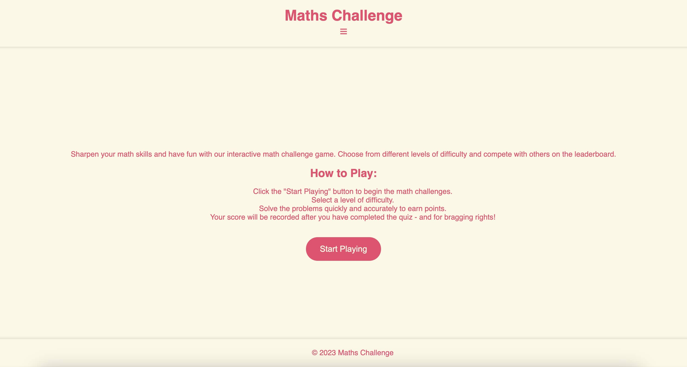
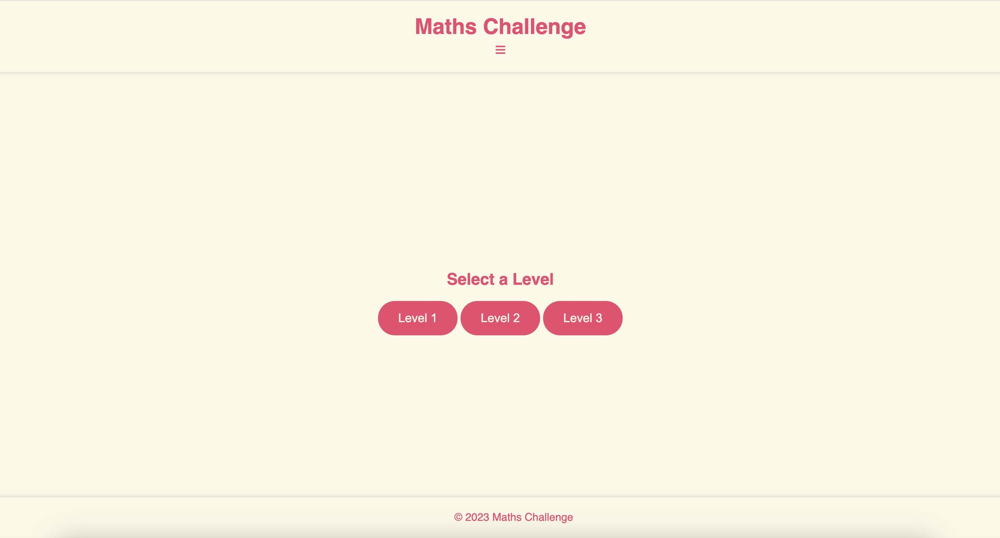
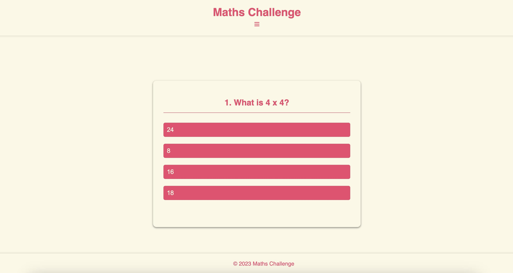
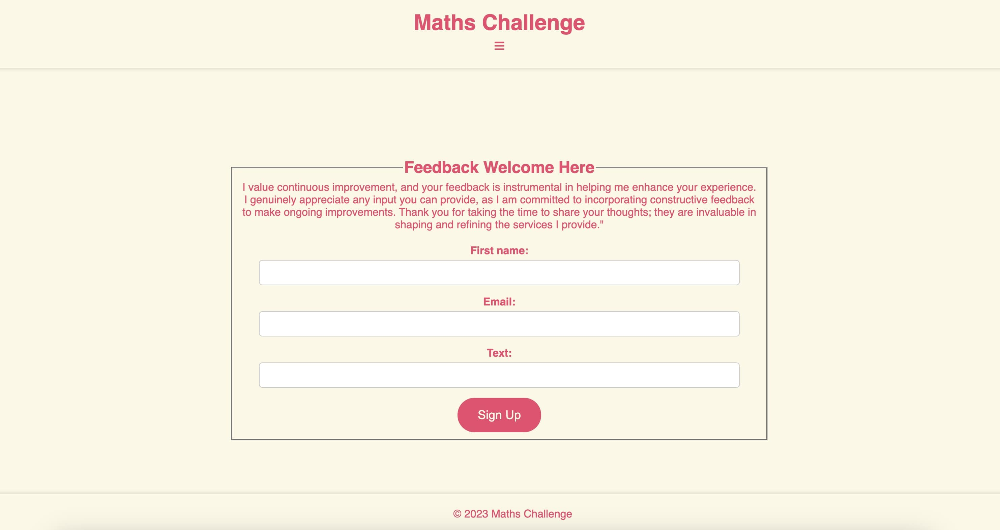
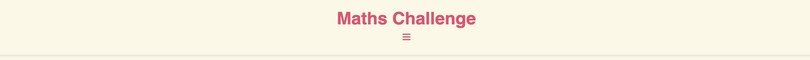
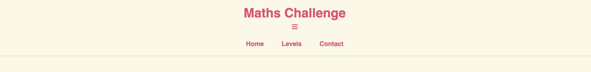
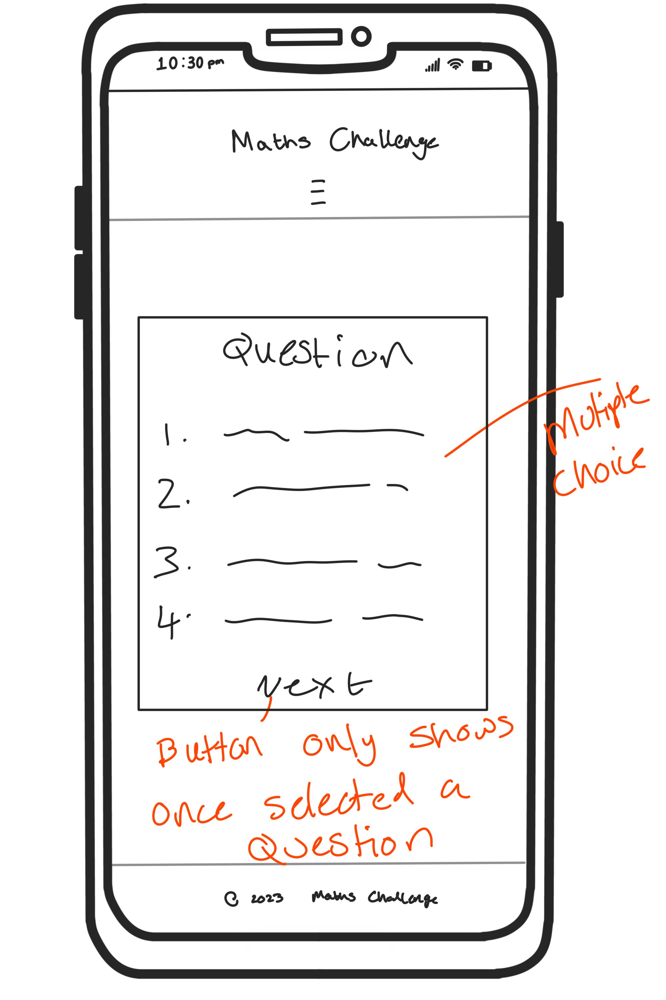
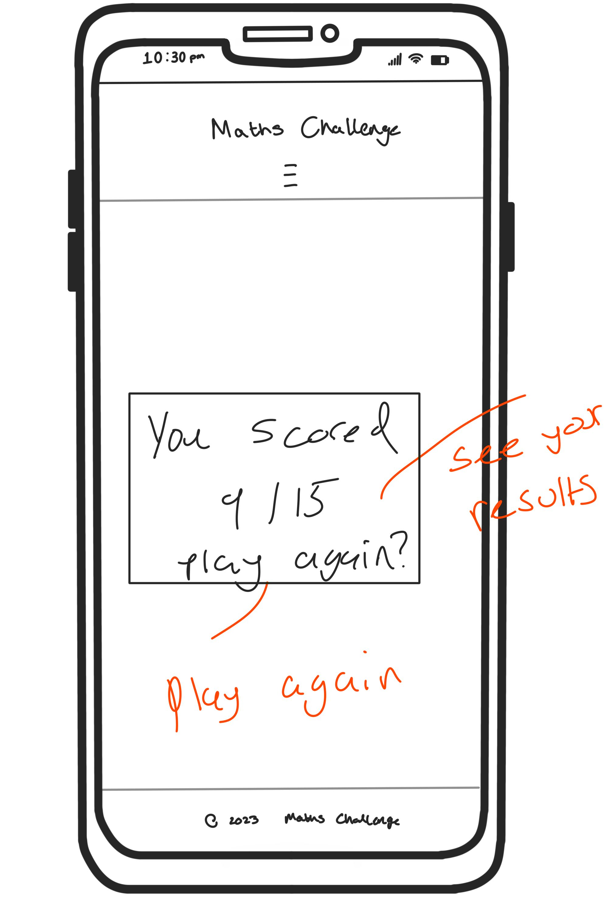

# Welcome to Maths Challenge! :video_game: :star2:

## Overview :brain:
Dive into the world of interactive learning and fun with our HTML-based math game! Maths challenge is designed to help you practice addition, subtraction, multiplication, and division through a series of random and challenging questions. This game offers a dynamic platform that combines the thrill of gaming with the benefits of improving your arithmetic skills.

## Why Choose Maths Challenge? :thinking:
- **Educational Fun:** Enjoy the excitement of gaming while learning math.
- **Randomized Questions:** Face a variety of challenges to keep you engaged.
- **Real-time Feedback:** Get instant feedback to enhance your understanding.
- **A chance to offer feedback:** Change the game to suit your needs. Your feedback has a high chance of getting implmented. I am always here to improve.

## Key Features :key:
- **Four Operations:** Practice addition, subtraction, multiplication, and division in one place.
- **Randomized Challenges:** Never face the same question twice to keep the excitement alive!
- **Leaderboard:** See how you stack up against others and track your progress.

## How to Play :book::open_book:
1. Click the "Start Playing" button to begin the math challenges.
2. Select a level of difficulty.
3. Solve the problems quickly and accurately to earn points.
4. Your score will be recorded after you have completed the quiz - and for bragging rights!
            
# Let the math games begin! :trophy:

## Features 

### Landing page 
This webpage is designed for a math challenge game where users can sharpen their math skills. It provides information about the game, instructions on how to play, and links to navigate through different sections such as levels and leaderboard. The design suggests a responsive layout, including a mobile-friendly menu. The inclusion of JavaScript indicates the potential for dynamic and interactive features on the webpage.

### Choose your level
This HTML code sets up a page where users can select a level for the math challenge game. The selected level triggers a JavaScript function (startGame) associated with the respective level number. The overall structure, styling, and navigation remain consistent with the previous page.

### Game Page
This page sets up a game for a math challenge game, providing a user interface for solving math problems and tracking scores. The page incorporates buttons for different math operations and dynamically updates the display based on user interactions.

### Contact Page
The contact.html page is where I have a chance to accept feedback from users. This includes a thankyou.html where the submit for will send you to go back to the index.html to start playing again if the user wishes. 

## The basics

### Header with an open and close navigation
I've decided to incorporate a discreet navigation feature that becomes visible upon clicking the three-lined icon. This menu encompasses the homepage, provides access to various levels for playing the math challenge game, and includes a leaderboard to monitor progress. Below, you can preview its appearance when both open and closed.

### Footer
Immerse yourself in the thrill of numbers with @2023 Maths Challenge. My footer proudly displays the essence of mathematical excellence, encapsulating the spirit of the challenge in a single phrase. 

## Wirefames

1. Index HTML:
- The index.html serves as the main entry point for your website. It typically contains:
- A welcoming and visually appealing introduction to your math game.
- Navigation links or buttons directing users to various sections of your website, such as the game levels, leaderboard, and any additional features.
- Any important information or instructions for users, such as how to play the game or system requirements.

2. Levels HTML:
- The levels.html page is where users can select the difficulty or level of the math game they want to play. It usually includes:
- An overview of the available difficulty levels (e.g., easy, medium, hard).
- Interactive elements like buttons or dropdowns that users can use to choose their desired level.
- Visual cues or brief descriptions for each level to help users make an informed choice.
- Navigation options to go back to the index page or proceed to the actual gameplay.

3. Game HTML:
- The game.html page is where the core gameplay takes place. It typically features:
- The actual math game interface, including the math problems, input fields for answers, and any interactive elements needed for gameplay.
- Visual elements such as a timer, score counter, or progress indicator to enhance the gaming experience.
- Clear instructions on how to play and any additional features, like hints or special power-ups.
- A way for users to navigate back to the index or levels page after completing the game.

4. Contact HTML:
- The contact.html page is where I have a chance to accept feedback from users.
- This includes a thankyou.html where the submit for will send you to go back to the index.html to start playing again if the user wishes.

5. Score
- Keep track of your score.
- Work on your progress and get the otption to play again. 

## Accessibility and Transparency

### Accessibility Statement
Committed to making *Maths Challenge* accessible to all users, complying with accessibility standards such as WCAG.

## Testing

# Responsive Design

Ensure the project is responsive across various screen sizes and browsers, adhering to the WCAG 2.1 Reflow criteria.

### Testing Procedure

1. Open your preferred browser and visit the Maths Challenge
2. Access developer tools by right-clicking and selecting inspect.
3. Set the view to responsive and reduce the width to 320px.
4. Adjust the zoom to 50%.
5. Drag the responsive window to its maximum width.

### Expected Outcome

- The website should seamlessly adapt to different screen sizes.
- Images must not appear pixelated or stretched.
- Horizontal scrolling should be avoided.
- Elements on the page should not overlap.

## Accessibility

Utilize the Wave Accessibility tool for ongoing development and final testing. Concentrate on the following criteria:

1. Ensure all forms have associated labels or appropriate aria-labels.
2. Validate that color contrasts meet the minimum ratios outlined in WCAG 2.1 Contrast Guidelines.
3. Verify correct heading levels to accurately convey content importance.
4. Confirm content is organized within landmarks for ease of use with assistive technology.
5. Provide alternative text or titles for non-textual content.
6. Set the HTML page lang attribute.
7. Implement Aria properties in adherence to best practices outlined in WCAG 2.1.
8. Follow established coding best practices for WCAG 2.1.

### Manual Testing

Identified accessibility issues:

**Issue #1:**
Hidden checkboxes and labels for the gallery filter and accordion were inaccessible via keyboard due to the use of `display: none;`. Used for the navigation, including the icons, such as, ☰, which i found from Microsoft word keyboard.

## Deployment

*Maths Challenge* is hosted on GitHub Pages, offering easy access to content and services. The deployment process involves selecting the Master Branch in the GitHub repository's Settings tab, with the live link providing direct access.

## Credits

I extend gratitude to Code Institute for knowledge in Javascript, HTML and CSS, enabling me to bring my ideas to life. The transformative journey from a nursing career to coding unveiled the skills I can create from determination and creativity. 

I have taken some skills I have learnt from code institute such as the drop down boxes, quizes in Javascript and incorporated it with some extra leanring on how to complete a quiz with multiple choice and a scoring system, which can be found [here](<https://www.youtube.com/watch?v=PBcqGxrr9g8>).

Creating better visual effects for my users experience was impirtant,I added an extra colour to links for users to know it was a link when they hovered their cursor of over the link. I got this informstion from [here](<https://developer.mozilla.org/en-US/docs/Web/CSS/:hover#>). 

Finally, I wanted to create a simple, soft, emotional vibe to my styles, by adding the opaque style to the containers - information found [here](<https://developer.mozilla.org/en-US/docs/Learn/CSS/Howto/Make_box_transparent>). Aswell as creating a background which relates to the activties of the page - this to me, created a chance for users to get a feel of what they could experience when practising our yoga. The images created by me using this [app](<https://www.sketchbook.com>) by taking the correct hex colors from the css and creating the maths icons. Also by creating my wireframes. 
