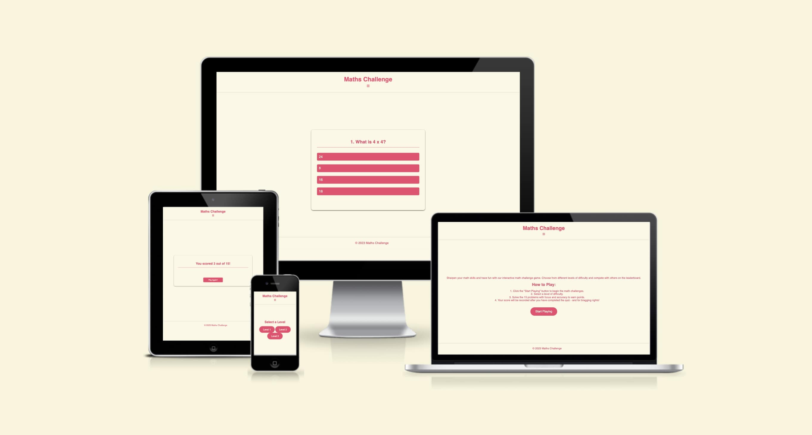

# Welcome to Maths Challenge! :video_game: :star2:

    
## Overview :brain:
Dive into the world of interactive learning and fun with our JavaScript-based math game! Maths challenge is designed to help you practice addition, subtraction, multiplication, and division through a series of random and challenging questions. This game offers a dynamic platform that combines the thrill of gaming with the benefits of improving your arithmetic skills.

## Why Choose Maths Challenge? :thinking:
- **Educational Fun:** Enjoy the excitement of gaming while learning math.
- **Randomized Questions:** Face a variety of challenges to keep you engaged.
- **Real-time Feedback:** Get instant feedback to enhance your understanding.
- **A chance to offer feedback:** Change the game to suit your needs. Your feedback has a high chance of getting implmented. I am always here to improve.

## Key Features :key:
- **Four Operations:** Practice addition, subtraction, multiplication, and division in one place.
- **Randomised Challenges:** Never face the same question twice to keep the excitement alive!
- **Leaderboard:** See how you stack up against others and track your progress.

## How to Play :book::open_book:
1. Click the "Start Playing" button to begin the math challenges.
2. Select a level of difficulty.
3. Solve the problems quickly and accurately to earn points.
4. Your score will be recorded after you have completed the quiz - and for bragging rights!


## Let the math games begin! :trophy:

# User Stories

### Students Seeking Math Practice
As a student, I want to use Maths Challenge to practice addition, subtraction, multiplication, and division in a fun and interactive way, helping me improve my math skills.
I want the game to provide randomised questions to keep me engaged and challenged.
Real-time feedback is crucial for me to understand my mistakes and learn from them.

### Teachers Looking for Educational Games
As a teacher, I am excited to introduce Maths Challenge to my students as an engaging and educational game.
I appreciate the variety of challenges offered by the game, helping students practice different math operations.
The leaderboard feature allows me to track the progress of my students and motivate them to improve.

### Parents Supporting Their Children's Learning
As a parent, I see Maths Challenge as a valuable tool for my child's math development.
I appreciate the option to select different difficulty levels to match my child's skill level.
The game's real-time feedback ensures my child is learning and grasping mathematical concepts effectively.

### Individuals Wanting to Enhance Quick Math Skills
As an individual seeking to improve my mental math skills, I find Maths Challenge to be a perfect platform.
The randomised challenges and time pressure help me think on my feet and improve my quick math calculations.
I value the leaderboard feature, as it allows me to compare my performance with others and set personal goals.

### Friends Competing Against Each Other
As friends looking for a fun and competitive math game, we enjoy the multiplayer aspect of Maths Challenge.
We can challenge each other by selecting the same difficulty level and see who can score higher.
The game's dynamic nature ensures that each round is a new and exciting experience.

### Users Seeking a Quick and Fun Brain Exercise
As someone looking for a quick and enjoyable brain exercise, I appreciate the simplicity and accessibility of Maths Challenge.
The game's structure, with different levels and randomized challenges, keeps me entertained during short breaks.
I can easily track my progress and see improvements in my math skills over time.

### Users Who Enjoy Providing Feedback
As a user who enjoys providing feedback, I appreciate the opportunity to share my thoughts on Maths Challenge.
Knowing that my feedback has a high chance of being implemented makes me feel valued as a user.
I find the contact page user-friendly, and the option to offer feedback adds to the overall positive experience.

### Competitive Individuals Looking for a Challenge
As a competitive individual seeking a challenging math game, I am drawn to the variety of questions in Maths Challenge.
The scoring system and leaderboard provide a clear measure of my performance against others.
I enjoy the thrill of competing and improving my rank on the leaderboard.


# Wirefames


1. Index HTML:
- The index.html serves as the main entry point for your website. It typically contains:
- A welcoming and visually appealing introduction to your math game.
- Navigation links or buttons directing users to various sections of your website, such as the game levels, leaderboard, and any additional features.
- Any important information or instructions for users, such as how to play the game or system requirements.


2. Levels HTML:
- The levels.html page is where users can select the difficulty or level of the math game they want to play. It usually includes:
- An overview of the available difficulty levels (e.g., easy, medium, hard).
- Interactive elements like buttons or dropdowns that users can use to choose their desired level.
- Visual cues or brief descriptions for each level to help users make an informed choice.
- Navigation options to go back to the index page or proceed to the actual gameplay.


3. Game HTML:
- The game.html page is where the core gameplay takes place. It typically features:
- The actual math game interface, including the math problems, input fields for answers, and any interactive elements needed for gameplay.
- Visual elements such as a timer, score counter, or progress indicator to enhance the gaming experience.
- Clear instructions on how to play and any additional features, like hints or special power-ups.
- A way for users to navigate back to the index or levels page after completing the game.


4. Contact HTML:
- The contact.html page is where I have a chance to accept feedback from users.
- This includes a thankyou.html where the submit for will send you to go back to the index.html to start playing again if the user wishes.


5. Score
- Keep track of your score.
- Work on your progress and get the otption to play again.


# Technologies Used

- **HTML/CSS:** Frontend styling and structure.
- **JavaScript:** Interactive features and game logic.
- **GitHub/Gitpod:** Version control and collaboration.

# Features 

### Landing page 
This webpage is designed for a math challenge game where users can sharpen their math skills. It provides information about the game, instructions on how to play, and links to navigate through different sections such as levels and leaderboard. The design suggests a responsive layout, including a mobile-friendly menu. The inclusion of JavaScript indicates the potential for dynamic and interactive features on the webpage.


### Choose your level
This HTML code sets up a page where users can select a level for the math challenge game. The selected level triggers a JavaScript function (startGame) associated with the respective level number. The overall structure, styling, and navigation remain consistent with the previous page.


### Game Page
This page sets up a game for a math challenge game, providing a user interface for solving math problems and tracking scores. The page incorporates buttons for different math operations and dynamically updates the display based on user interactions.


### Contact Page
The contact.html page is where I have a chance to accept feedback from users. This includes a thankyou.html where the submit for will send you to go back to the index.html to start playing again if the user wishes. 


## The basics

### Header with an open and close navigation
I've decided to incorporate a discreet navigation feature that becomes visible upon clicking the three-lined icon. This menu encompasses the homepage, provides access to various levels for playing the math challenge game, and includes a leaderboard to monitor progress. Below, you can preview its appearance when both open and closed.


### Footer
Immerse yourself in the thrill of numbers with @2023 Maths Challenge. My footer proudly displays the essence of mathematical excellence, encapsulating the spirit of the challenge in a single phrase. 


# Deployment

### Making a Local Clone to create project

- Find the GitHub Repository.
- Click the Code button
- Copy the link shown.
- In Gitpod, change the directory to the location you would like the cloned directory to be located.
- Type git clone, and paste the link you copied in step 3.
- Press Enter to have the local clone created.

### Updating my changes

git add <file> - This command was used to add the file(s) to the staging area before they are committed.

git commit -m “commit message” - This command was used to commit changes to the local repository queue ready for the final step.

git push - This command was used to update all committed code to the remote repository on github.

### Github

This project, *The Maths Challenge*, is deployed using GitHub pages using the following process,

### Deploying a GitHub Repository via GitHub Pages

- In your Repository section, select the Repository you wish to deploy.
- In the top horizontal Menu, locate and click the Settings link.
- Inside the Setting page, around halfway down locate the GitHub Pages Section.
- Under Source, select the None tab and change it to Main and click Save.
- Finally once the page resets scroll back down to the GitHub Pages Section to see the following message "Your site is ready to be published at (Link to the GitHub Page Web Address)". It can take time for the link to open your project initially, so please don't be worried if it does not load immediately.


# Testing

## Responsiveness
The Maths Challenge website was tested for responsiveness on screen sizes from 320px and above, following WCAG 2.1 Reflow criteria for responsive design. The testing was performed on Chrome, Edge, and Opera browsers.

Below are the images to show the responisiveness on all pages, this was done using the extension [Responsive Viewer](https://chromewebstore.google.com/detail/responsive-viewer/inmopeiepgfljkpkidclfgbgbmfcennb?hl=en-GB&utm_source=ext_sidebar) on [Google](https://chromewebstore.google.com/category/extensions?utm_source=ext_sidebar&hl=en-GB).

<details>
<summary>Click to expand</summary>

#### Home

...
</details>

## Compatability

The project has been tested for compatibility with the following browsers using this site. Unfortunately the trail on my account would not cover macOS which is why the images may look different:

- Google Chrome (Version 122)
- Edge (Version 122)
- Firefox (Version 124)
- Opera (Version 108)
- macOS Sonoma 16.5

Below are the images shown to prove these tests.

<details>
<summary>Click to expand.</summary>

#### Google Chrome

...
</details>


## Accessibility

By utilising the Wave Accessibility tool for ongoing development and final testing, used for the below:

1. Ensure all forms have associated labels or appropriate aria-labels.
2. Validate that color contrasts meet the minimum ratios outlined in WCAG 2.1 Contrast Guidelines.
3. Verify correct heading levels to accurately convey content importance.
4. Confirm content is organized within landmarks for ease of use with assistive technology.
5. Provide alternative text or titles for non-textual content.
6. Set the HTML page lang attribute.
7. Implement Aria properties in adherence to best practices outlined in WCAG 2.1.
8. Follow established coding best practices for WCAG 2.1.


## Lighthouse Testing
Integrated into Chrome Developer Tools or available as a standalone tool.
  Below you can see the Lighthouse results for all pages
- index.html

- levels.html

- contact.html


## Manual Testing

| Function | User Action | Outcome | Result |
|----------|-------------|---------|--------|
| Start on Home Page | Accessing the webpage using [this link](https://abikirkham.github.io/maths-challenge/index.html) | This will load the webpage with mutliple sections, the appropriate selectors and navigation/links to other pages. | Pass |
| Hover on buttons and links | Hover mouse over buttons and links | Visual feedback (e.g., color change) | Pass |
| Sections | Navigate through different sections | Display respective section content using HTML and CSS to be consistant | Pass |
| Background on all pages | Nothing for user to do | Background image should load on this page without distortion | Pass |
| Navigation | Click on navigation icon to bring the drop down function elements to show | Drop down menu acts as expected even on smaller screens | Pass |
| About page | Click the about page link in navigation bar | Display information about the benefits, ecesitites and sample content | Pass |
| Audio | Interact with audio elements | Play, pause, adjust volume, etc. | Pass |
| Classes page | Click the about page link in navigation bar | Display the class sections through sections withing containers, tables and images | Pass |
| Sections | Navigate through categorised sections | Display categorised section content | Pass |
| Images | Accessed on the classes page | Show images with no distortion | Pass |
| Tables | Accessed on the classes page | Visually show the table with no issues when move to smaller screens | Pass |
| Blog | Access blog page | Display list of blog posts | Pass |
| Sections (Blog1, Blog2, Blog3, Blog4, Blog5) | Navigate through blog sections | Display respective blog post content | Pass |
| Contact | Accessed through navigation bar | Input first name, last name, email, etc. | Pass |
| Name Field | Input first name | Allows user interaction | Pass |
| Name Field | Input last name | Allows user interaction | Pass |
| Email Field | Input email | Allows user interaction | Pass |
| Submit | Clicks button - submit contact form | Accepts form data and opens redirect page | Pass |
| If not filled (Name, Last Name, Email) | Submit contact form with missing fields | Validation error message will show, notifying the user to fill field out | Pass |
| Redirect page | Submit contact form successfully | Redirect to a confirmation page, showing thank you message and that this page is on a time and will redirect in 10 seconds | Pass |
| Timer | Trigger timer functionality when opens the Redirct page | After 10 seconds the page will open the home page without user interaction | Pass |


### Scenario One - Correct Inputs

**Steps to test:**

1. Navigate to Maths Challenge - Home Page
2. Scroll down to the form and input the following data:
   - First Name: Jane
   - Last Name: Doe
   - Email: doe.jane@test.com
   - Comment: This is a test.
3. Click Submit
4. User should be redirected to `index.html` confirmation page

**Expected:**

Form submits with no warnings or errors, and the user is redirected to `thankyou.html` confirmation page.

**Actual:**

The website behaved as expected with no errors or warnings and redirected to `thankyou.html`.


### Scenario Two - Missing Required Field First Name

**Steps to test:**

1. Navigate to Maths Challenge - Home Page
2. Scroll down to the form and input the following data:
   - First Name:
   - Last Name: Doe
   - Email: doe.jane@test.com
   - Comment: This is a test.
3. Click Submit

**Expected:**

The form does not submit, and an error is displayed to tell the user that the field is required.

**Actual:**

The website behaved as expected; an error message was displayed, and the form did not submit.INCLUDE IMG

### Scenario Three - Missing Required Field Last Name

**Steps to test:**

1. Navigate to Maths Challenge - Home Page
2. Scroll down to the form and input the following data:
   - First Name: Jane
   - Last Name:
   - Email: doe.jane@test.com
   - Comment: This is a test.
3. Click Submit

**Expected:**

The form does not submit, and an error is displayed to tell the user that the field is required.

**Actual:**

The website behaved as expected; an error message was displayed, and the form did not submit.INCLUDE IMG

### Scenario Four - Missing Required Field Email

**Steps to test:**

1. Navigate to Maths Challenge - Home Page
2. Scroll down to the form and input the following data:
   - First Name: Jane
   - Last Name: Doe
   - Email:
   - Comment: This is a test.
3. Click Submit

**Expected:**

The form does not submit, and an error is displayed to tell the user that the field is required.

**Actual:**

The website behaved as expected; an error message was displayed, and the form did not submit.INCLUDE IMG

### Scenario Five - Incorrect email format

**Steps to test:**

1. Navigate to Maths Challenge - Home Page
2. Scroll down to the form and input the following data:
   - First Name: Jane
   - Last Name: Doe
   - Email: doe.janetest.com
   - Comment: This is a test.
3. Click Submit

**Expected:**

The form does not submit, and an error is displayed to tell the user that a valid email is required and the format it should be in.

**Actual:**

The website behaved as expected; an error message was displayed, and the form did not submit. INCLUDE IMG


## Unfixed Errors

**Issue #1:** With the support and guidance with the communities on slack and from tutors at code institute providing my with all information on how to adjust the images on multi sized screens to fit in the containers. However, on smaller screens these images do present stretched.
 INCLUDE IMG

**Issue #2:** Hidden checkboxes and labels for the gallery filter and accordion were inaccessible via keyboard due to the use of `display: none;`. Used for the navigation, including the icons, such as, ☰, which I found from Microsoft word keyboard.

## Validator Testing I NEED ALL IMAGES FOR THE TESTING 

### HTML
No errors were found when using the official W3C validator for HTML.


### CSS
No errors were found when using the official (Jigsaw) validator for CSS.


# Bugs, errors and changes

I had received feedback to generate more personalised code after working with this YouTube video to assist me to create this game. I decided to merge the levels for better code readability. I used a range of sources to help me do this, which will be credited throughout this section, as well as the tutor support at code institute. 

First I had 3 java script pages one for each level (easy.js, medium.js, hard.js), I also had 3 htmls liked to each one of the levels. To begin with I decided to create a game.js and copy and paste all the levels are in the same place, this was so I could first establish the game levels, I knew to do this from the first lessons on java in code institute to put the data I have on the sheet first, I incorporate this from the video too :

```javascript
document.addEventListener('DOMContentLoaded', function () {
// Establish game levels
const quizData = {
    easy: [
        {
            question: "What is 4 x 4?",
            answers: [
                { text: "24", correct: false },
                { text: "8", correct: false },
                { text: "16", correct: true },
                { text: "18", correct: false },
            ], ...
    
    medium: [
        {
            question: "What is 7 x 8?",
            answers: [
                { text: "45", correct: false },
                { text: "58", correct: false },
                { text: "56", correct: true },
                { text: "48", correct: false },
            ], ...

     hard: [
        {
            question: "What is 23 x 17?",
            answers: [
                { text: "327", correct: false },
                { text: "402", correct: false },
                { text: "391", correct: true },
                { text: "361", correct: false },
            ]
            }, 
    ]
}; ...
```

https://www.w3schools.com/jsref/met_document_addeventlistener.asp 
https://www.w3schools.com/jsref/dom_obj_document.asp 

As I have now moved all questions, this leaves the remaining code three times, I removed the unwanted repeative code and left this one section as seen below:

```javascript
// Get HTML elements by their IDs
const questionElement = document.getElementById("question");
const answerButtons = document.getElementById("answer-buttons");
const nextButton = document.getElementById("next-btn");

// Variables to keep track of the current question index and the player's score
let currentQuestionIndex = 0;
let score = 0;

// Function to start the quiz by resetting variables and showing the first question
function startQuiz() {
  currentQuestionIndex = 0;
  score = 0;
  updateUI();
}

// Function to update the UI with the current question and answer options
function updateUI() {
  resetState(); // Clear previous question state
  const currentQuestion = questions[currentQuestionIndex];
  const questionNo = currentQuestionIndex + 1;
  questionElement.innerHTML = `${questionNo}. ${currentQuestion.question}`;

  // Create buttons for each answer option and attach event listeners
  currentQuestion.answers.forEach(answer => {
    const button = document.createElement("button");
    button.innerHTML = answer.text;
    button.classList.add("btn");
    answerButtons.appendChild(button);
    if (answer.correct) {
      button.dataset.correct = answer.correct;
    }
    button.addEventListener("click", handleAnswerSelection);
  });
}

// Function to reset the state of the quiz (clear answer buttons and hide next button)
function resetState() {
  nextButton.style.display = "none";
  while (answerButtons.firstChild) {
    answerButtons.removeChild(answerButtons.firstChild);
  }
}

// Function to handle the selection of an answer
function handleAnswerSelection(event) {
  const selectedBtn = event.target;
  const isCorrect = selectedBtn.dataset.correct === "true";
  if (isCorrect) {
    selectedBtn.classList.add("correct");
    score++;
  } else {
    selectedBtn.classList.add("incorrect");
  }
  disableAnswerButtons();
  nextButton.style.display = "block"; // Show the next button
}

// Function to disable all answer buttons after an answer is selected
function disableAnswerButtons() {
  Array.from(answerButtons.children).forEach(button => {
    if (button.dataset.correct === "true") {
      button.classList.add("correct");
    }
    button.disabled = true;
  });
}

// Function to handle the next button click
function handleNextButtonClick() {
  currentQuestionIndex++;
  if (currentQuestionIndex < questions.length) {
    updateUI();
  } else {
    showScore();
  }
}

// Function to display the final score at the end of the quiz
function showScore() {
  resetState();
  questionElement.innerHTML = `You scored ${score} out of ${questions.length}!`;
  nextButton.innerHTML = "Play Again?";
  nextButton.style.display = "block";
}

// Event listener for the next button
nextButton.addEventListener("click", () => {
  if (currentQuestionIndex < questions.length) {
    handleNextButtonClick();
  } else {
    startQuiz(); // If quiz is finished, restart it
  }
});

// Start the quiz when the page loads
startQuiz();this was displayed 3 times so I removed the remainder 2 and saved the code at this point. 
```

Now, as this was now on 1 html and 1 javascript, I needed to add new functions and event listeners for the game so the user will be able to chose the level they want and this will load the correct game :


```javascript
function hideOtherLevels(selectedLevel) {
    const levels = ['easy', 'medium', 'hard'];
    levels.forEach(level => {
        if (level !== selectedLevel) {
            document.getElementById(level).style.display = 'none';
        } else {
            document.getElementById(level).style.display = 'block';
        }
    });
}

// Call appropriate level based on user selection or default
function startGame(level) {
    if (level === 'easy' || level === 'medium' || level === 'hard') {
        startQuiz(level);
    } else {
        // Default to easy level if no level is specified
        startQuiz('easy');
    }
}

// Attach event listeners to start quiz buttons
document.getElementById('easyButton').addEventListener('click', function() {
    startGame('easy');
});


document.getElementById("mediumButton").addEventListener("click", function () {
    startGame("medium");
});

document.getElementById("hardButton").addEventListener("click", function () {
    startGame("hard");
});
});
```

https://stackoverflow.com/questions/64712803/change-game-difficulty-javascript 

I attempted to play this game however this did not work, I went back to look at my code and because of the merge, some id elements names were not matched up,  I fixed this bug howeer the game still did not load as it should, I decided to go to Code Institutes Tutor Support who discussed with me the next button was not identified, (GET THE SCREENSHOT) once this was re-written, the game loaded as it should. 

Then I need to figure out how to hide the other levels because that doesn’t work…

Then run through testing …


# Credits

* Inspiration from Love Running project provided by Code Institute
* [WebDevSimplified JavaScript Quiz App](https://github.com/WebDevSimplified/JavaScript-Quiz-App/blob/master/script.js)
* [YouTube Tutorial on JavaScript Quiz App](https://www.youtube.com/watch?v=PBcqGxrr9g8)
* [MDN Web Docs for CSS :hover Effect](https://developer.mozilla.org/en-US/docs/Web/CSS/:hover#)
* [YouTube Tutorial on Navigation Bar](https://www.youtube.com/watch?v=iXKScihfSwE)
* [w3schools](https://www.w3schools.com/) for reference on proper structure and code writing
* Signup form and redirection page guidance from mentor Gareth McGirr Tacos Travels
* Flexbox guidance from Daisy McGirr
* README image sizes - [uupaa Gist](https://gist.github.com/uupaa/f77d2bcf4dc7a294d109)


